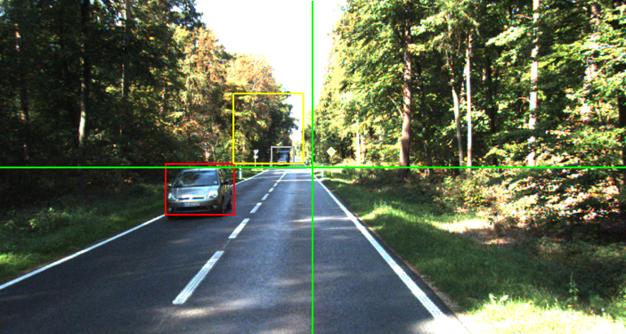
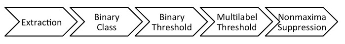
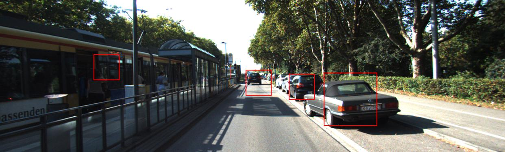
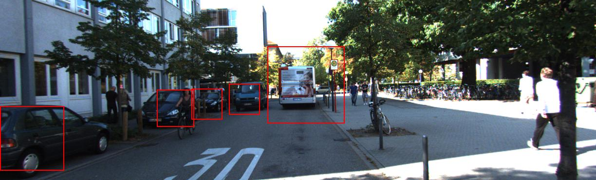
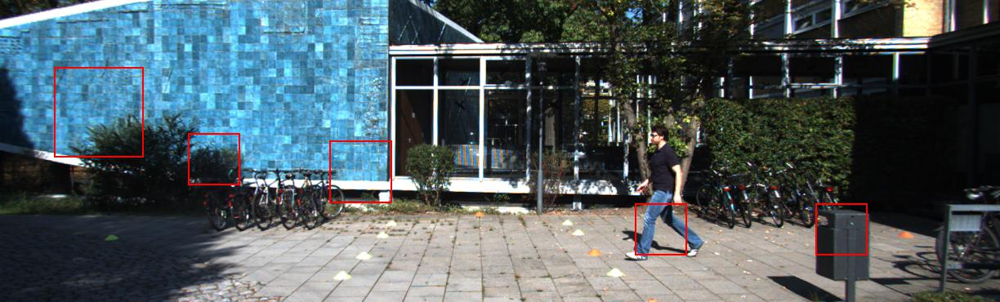
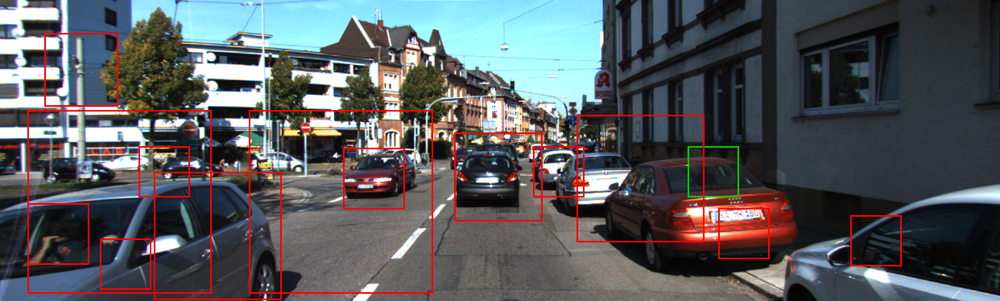

# Deep Perception
## Ramin Zohouri   Martin Goth

----

## Models
### Multilabel model
* 8-class 
* 64, 64, 128

3 stage convolutional network

    64 x 14 x 14 feature map
    64 x  5 x  5 feature map
    dual layer   perceptron

----

## Models
### Binary model

* Object / None

Smaller network of same structure

    32 x 14 x 14 feature map
    32 x  5 x  5 feature map
    dual layer   perceptron

----

## Data extraction
### Generally

* Patches at 32 x 32
* Rescaling
   * Insert gray bars  
     Preserves ratio
   * Downsampling (Scaling)
* Distortion by mirroring
* Local Spatial Contrastive Normalization

----

## Data extraction
### None patches

* Extract square image for each object
* Global normalization parameters for testing extracted
* Tried extraction in greyscale space

---

* Could contain object but probability for full hit is rather low.

----

## Training

* 18 epoches for multi label classifier
* 3 epoches for binary label classifier  
  More time consuming
<!-- Images here -->

----

### Results
#### Multi Label

---

    average row correct: 85.81% 
    global correct: 85.81% 

#### Binary

     [ 196    4]  98.000% 	[Object]
     [   2  198]  99.000% 	[ None ]
 
     average row correct: 98.50% 
     global correct: 98.50%

----

## Testing

* Minimal patch size 64x64
* Scale factor of 1.3x
* Stride factor of 0.1x
* 11176 samples per image

----

### Pipeline

* Label samples that pass binary classifier and threshold
* Non maxima suppression at the very end
  * Overlap of 0.2 suffices

----

## Good Results

----

## Bad Results

---- 

# Thank you!

## For your attention
## For your help and collabotation

